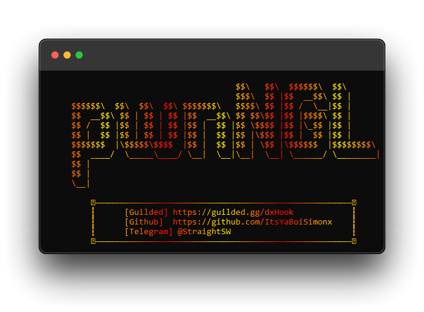

<h1 align="center">🗝 pwnNGL, a simple tool that exploits NGL's API to send messages.</h1>

<p align="center">
    
    
    
    
    
</p>


This tool is fully made in Python, it features active logging, a simple terminal-based UI and extremely fast request times!

<h1 align="center">- USAGE -</h1>

Direct releases will be out very soon, but as of right now, you can just ```git clone``` the repository and manually run it.

```
$ git clone https://github.com/ItsYaBoiSimonx/pwnNGL
```
If you find ANY issues with this program after you've tried it yourself, don't be afraid to make a pull request!
<p align="center">
  
</p>