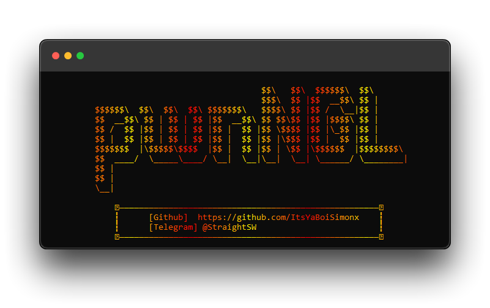

<h1 align="center">🗝 pwnNGL, a simple tool that exploits NGL's API to send messages.</h1>

<p align="center">
    
    
    
    
</p>

Obviously, as previously mentioned, you will need the newest version of python downloaded off the official [python.org](https://www.python.org/downloads) website ([and added to path](https://www.youtube.com/watch?v=3a3UOSBffUI)) to run this.

This tool is fully made in Python, it features active logging, a simple terminal-based UI and extremely fast request times!

This project also features a well-optimized proxy checker; it utilizes over 200 CPU threads to compute requests as fast as possible.

<h1 align="center">- USAGE -</h1>

Direct releases will be out very soon™, but as of right now, you can just ```git clone``` the repository and manually run it.

```
$ git clone https://github.com/ItsYaBoiSimonx/pwnNGL
```

- If you find ANY issues with this program after you've tried it yourself, don't be afraid to make a pull request or dm me on telegram, @StraightSW 🎉

<p align="center">
  
</p>

<h2 align="center">
    ‼ Just as a warning, I am not responsible for anything you do with this project ‼
    <br>
    Have fun with it, just not too much.
</h2>